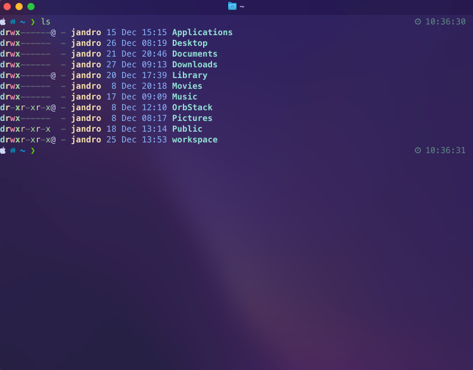
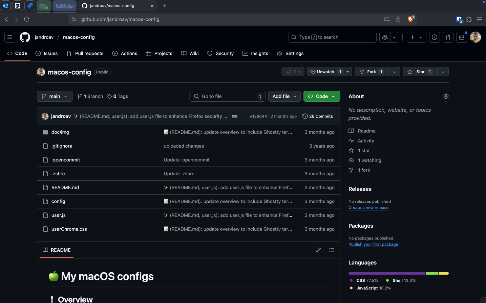
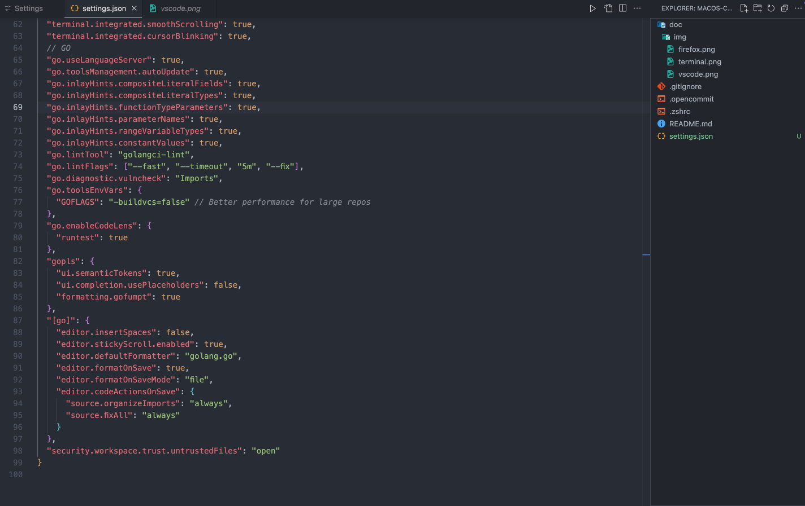
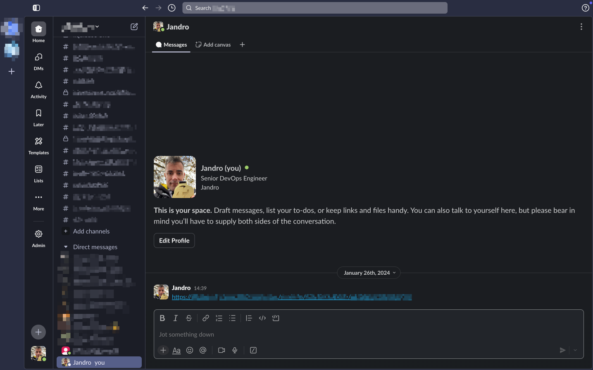

# :green_apple: My macOS configs

## :grey_exclamation: Overview

This repository includes several configuration files I use, as well as a list of recommended `macOS` applications, `brew` packages, and `vscode` extensions and configuration for a minimal UI look. The configuration is tailored for the [Ghostty terminal](https://github.com/ghostty-org/ghostty), using `zsh` as the default shell and is enhanced with the powerful `oh-my-zsh` framework.



## :wrench: Configuration files

- [.zshrc](./.zshrc): My customized `zsh` setup with aliases, functions, and plugins for enhanced productivity.
- [.opencommit](./.opencommit): OpenCommit is an open-source command-line interface (CLI) tool designed to enhance the quality of your Git commit messages by leveraging AI language models. By analyzing your code changes, OpenCommit generates concise and informative commit messages, improving the clarity and professionalism of your project’s history.
- [vscode settings](./settings.json): My `vscode` terminal configuration.
- `ghostty`: I am not currently using any custom configuration. It provides good defaults.

You need to install the following brew packages in order to boost the `zsh` terminal:

- [zsh-history-substring-search](https://github.com/zsh-users/zsh-history-substring-search)
- [zsh-syntax-highlighting](https://github.com/zsh-users/zsh-syntax-highlighting)
- [zsh-autosuggestions](https://github.com/zsh-users/zsh-autosuggestions)

## :dango: Recommended apps and packages

### :apple: apps

- [Ghostty](https://github.com/ghostty-org/ghostty): Ghostty is a terminal emulator that differentiates itself by being fast, feature-rich, and native. While there are many excellent terminal emulators available, they all force you to choose between speed, features, or native UIs. Ghostty provides all three
- [Raycast](https://www.raycast.com/): Raycast is a powerful, keyboard-driven productivity tool for macOS that lets users quickly perform tasks, run commands, and manage workflows through an intuitive launcher interface.
- [Meeter](https://apps.apple.com/de/app/meeter-for-zoom-teams-co/id1510445899?l=en-GB&mt=12): Meeter is a macOS app that centralizes all your calendar events and online meeting links, enabling you to quickly join meetings from various platforms like Zoom, Google Meet, or Microsoft Teams in one click.
- [Latest](https://apps.apple.com/de/app/meeter-for-zoom-teams-co/id1510445899?l=en-GB&mt=12): Software and apps update checker.
- [Orbstack](https://orbstack.dev/): OrbStack is a lightweight, high-performance virtualization and containerization platform for macOS. It simplifies running Linux VMs, Docker containers, and other workloads by providing a fast, integrated environment designed for developers. OrbStack focuses on efficiency, minimizing resource usage, and offers seamless macOS integration with features like file sharing and networking. It aims to be an alternative to solutions like Docker Desktop, with an emphasis on speed and developer-friendly workflows.
- [PastePal](https://apps.apple.com/es/app/pastepal-clipboard-manager/id1503446680): PastePal is a clipboard manager for macOS that helps users efficiently manage and organize their copied text, images, and files. It features a clean interface, quick access via a global shortcut, and advanced functionalities like searching, pinning, and syncing clips across devices. Designed for productivity, PastePal integrates seamlessly with macOS, offering privacy-focused clipboard history management and customization options for a streamlined workflow.
- [Shottr](https://shottr.cc/): Shottr is a macOS screenshot tool designed for speed and precision, offering features like pixel-perfect annotations, OCR for text extraction, scrolling screenshots, and on-the-fly image editing. It is lightweight and caters to developers, designers, and anyone needing advanced screenshot capabilities, while maintaining a user-friendly and minimalistic interface.
- [Stats](https://github.com/exelban/stats): Provides real-time statistics on your Mac’s hardware and performance. It offers insights into CPU usage, memory, disk activity, network traffic, and battery health. With a clean and simple interface, Stat allows users to monitor system performance, optimize workflows, and troubleshoot issues directly from the menu bar. It’s designed for users who want to keep track of their Mac’s vital statistics in an efficient, non-intrusive way.

## :goat: Special mention: Brave browser

I use Brave as my go-to browser for DevOps work because it strikes the perfect balance between privacy and compatibility. It respects user privacy by blocking trackers and ads by default, while still being fully compatible with modern web standards—ensuring seamless access to dashboards, cloud consoles, and automation tools. I configure it following the [Brave Browser Privacy Guides](https://www.privacyguides.org/en/desktop-browsers/#brave) for enhancement security and privacy.



I use a custom theme to align with other tools I use: [OneDark-Pro-Chromium](https://github.com/VictorPLopes/OneDark-Pro-Chromium).

I only use one extension which is my work/peronal password manager of choice: BitWarden. No need to install adblocking extensions since [Brave Browser already handles as blocking features](https://brave.com/shields/).

### :space_invader: packages

- [Ghostty](https://github.com/ghostty-org/ghostty)
- [Z](https://github.com/jethrokuan/z)
- [ccat](https://github.com/owenthereal/ccat)
- [eza](https://github.com/eza-community/eza)
- [opencommit](https://github.com/di-sukharev/opencommit)

### :nut_and_bolt: VSCode extensions

- [GitHub Copilot](https://marketplace.visualstudio.com/items?itemName=GitHub.copilot)
- [GitHub Actions](https://marketplace.visualstudio.com/items?itemName=GitHub.vscode-github-actions)
- [GitLens](https://marketplace.visualstudio.com/items?itemName=eamodio.gitlens)
- [HashiCorp Terraform](https://marketplace.visualstudio.com/items?itemName=HashiCorp.terraform)
- [Output Colorizer](https://marketplace.visualstudio.com/items?itemName=IBM.output-colorizer)
- [Prettier](https://marketplace.visualstudio.com/items?itemName=esbenp.prettier-vscode)
- [YAML](https://marketplace.visualstudio.com/items?itemName=redhat.vscode-yaml)
- [Docker](https://marketplace.visualstudio.com/items?itemName=ms-azuretools.vscode-docker)
- [One Dark Pro Theme](https://marketplace.visualstudio.com/items?itemName=zhuangtongfa.Material-theme)
- [Material Icon Theme](https://marketplace.visualstudio.com/items?itemName=PKief.material-icon-theme)

My full list:

```txt
adpyke.codesnap
christian-kohler.path-intellisense
databricks.sqltools-databricks-driver
davidanson.vscode-markdownlint
eamodio.gitlens
esbenp.prettier-vscode
formulahendry.code-runner
github.copilot
github.copilot-chat
github.vscode-github-actions
golang.go
gruntfuggly.todo-tree
hashicorp.terraform
hurly.sqltools-oracle-driver
koszti.snowflake-driver-for-sqltools
mechatroner.rainbow-csv
ms-azuretools.vscode-docker
ms-python.debugpy
ms-python.python
ms-python.vscode-pylance
mtxr.sqltools
mtxr.sqltools-driver-mssql
mtxr.sqltools-driver-mysql
mtxr.sqltools-driver-pg
pbkit.vscode-pbkit
pkief.material-icon-theme
redhat.java
tomoki1207.pdf
visualstudioexptteam.intellicode-api-usage-examples
visualstudioexptteam.vscodeintellicode
vue.volar
wayou.vscode-todo-highlight
yzhang.markdown-all-in-one
zhuangtongfa.material-theme
```

This is how my `VSCode` looks like:



## Bonus tip: Slack

Import this color scheme if you want a One Dark Pro look: `#24283B,#565F89,#9ECE6A,#F7768E`


