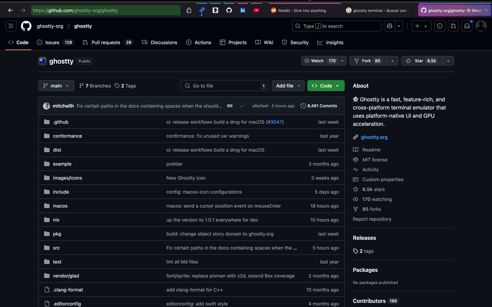

# :green_apple: My macOS configs

## :grey_exclamation: Overview

This repository includes my configuration files for `oh-my-zsh`, as well as a list of my current `macOS` applications, `brew` packages, and `vscode` extensions. The configuration is tailored for the `macOS` built-in terminal emulator, using `zsh` as the default shell and is enhanced with the powerful `oh-my-zsh` framework.

## :nail_care: Theme

I am using the [Powerlevel10k - Dracula](https://draculatheme.com/powerlevel10k) theme for a sleek, modern look with informative prompts.

## :eyes: Why Stick with Built-in macOS Apps?

## Firefox browser

I chose Firefox for my DevOps work because it offers unique features that align perfectly with the demands of my workflow. One standout feature is its `multi-container` capability. This allows me to isolate contexts into specific containers, making it easy to manage multiple AWS accounts simultaneously. For example, I can have several `AWS` accounts open in the same browser window, each in its own tab, without cross-contamination of cookies or sessions.

Additionally, Firefox enables better personalization through support for plain `CSS` customization. This means I can tweak the browser’s appearance to match my preferences or create custom styles that improve productivity, especially when dealing with dashboards or text-heavy interfaces. These features combine to make Firefox an invaluable tool for my DevOps tasks, offering both functional flexibility and a personalized experience.



## :wrench: Included Configurations

- **Zsh Configuration (`.zshrc`)**: My customized `zsh` setup with aliases, functions, and plugins for enhanced productivity.
- **.p10k.zsh**: [Powerlevel10k - Dracula](https://draculatheme.com/powerlevel10k) theme configuration file.
- **Brew Packages**: A list of essential packages installed via Homebrew.
- **macOS Applications**: A curated list of macOS applications that I use, focused on performance and security.
- **VSCode Extensions**: A collection of my most-used Visual Studio Code extensions to streamline development.

## :white_check_mark: Getting Started

### 1. Install `oh-my-zsh`

First, you need to install `oh-my-zsh`: https://ohmyz.sh/#install

### 2. Copy the Configuration Files

```bash
git clone https://github.com/jandroav/macos-config.git
cd macOS-terminal-config
cp .zshrc ~/
cp .p10k.zsh ~/
```

### 3. Install packages and extension (Optional)

```bash
sh install_packages_extensions.sh
```

## :dango: Additional goodies

Check the following links if you want to get some additional goodies:

* [Z](https://github.com/jethrokuan/z)
* [Exa](https://the.exa.website)
* [opencommit](https://github.com/di-sukharev/opencommit)

## :floppy_disk: Applications

`ls -1 /Applications/ > apps.txt`

```
ChatGPT.app
DBeaver.app
'DisplayLink Manager.app'
Firefox.app
'GPG Keychain.app'
Hush.app
Latest.app
Meeter.app
Numbers.app
OnyX.app
OrbStack.app
PastePal.app
'Proton Mail.app'
'Proton Mail Uninstaller.app'
Raindrop.io.app
Raycast.app
Reeder.app
'Save to Raindrop.io.app'
Shottr.app
Signal.app
Slack.app
Stats.app
TrashMe.app
Utilities
'Visual Studio Code.app'
Wipr.app
'YubiKey Manager.app'
zoom.us.app
```

## :beers: brew packages

`brew list -1 > brew_packages`

```
==> Formulae
aom
awscli
brotli
c-ares
ca-certificates
cairo
ccat
cffi
cloud-nuke
cryptography
eza
fontconfig
freetype
fribidi
gd
gdk-pixbuf
gettext
giflib
glib
graphite2
graphviz
gts
harfbuzz
highway
icu4c@76
imath
jasper
jpeg-turbo
jpeg-xl
lz4
lzo
m4
maven
mpdecimal
netpbm
node
openexr
openjdk
openssl@3
pango
pcre2
pipx
pixman
powerlevel10k
pycparser
python-packaging
python@3.12
python@3.13
readline
shellcheck
spacectl
sqlite
terraform
webp
xorgproto
xz
zoxide
zsh-autosuggestions
zsh-history-substring-search
zsh-syntax-highlighting
zstd

==> Casks
orbstack
stats
```

## :nut_and_bolt: vscode extensions

`code --list-extensions > vscode_extensions`

```
eamodio.gitlens
esbenp.prettier-vscode
github.copilot
github.copilot-chat
github.vscode-github-actions
hashicorp.terraform
ibm.output-colorizer
ms-azuretools.vscode-docker
ms-kubernetes-tools.vscode-kubernetes-tools
natqe.reload
redhat.vscode-yaml
```
