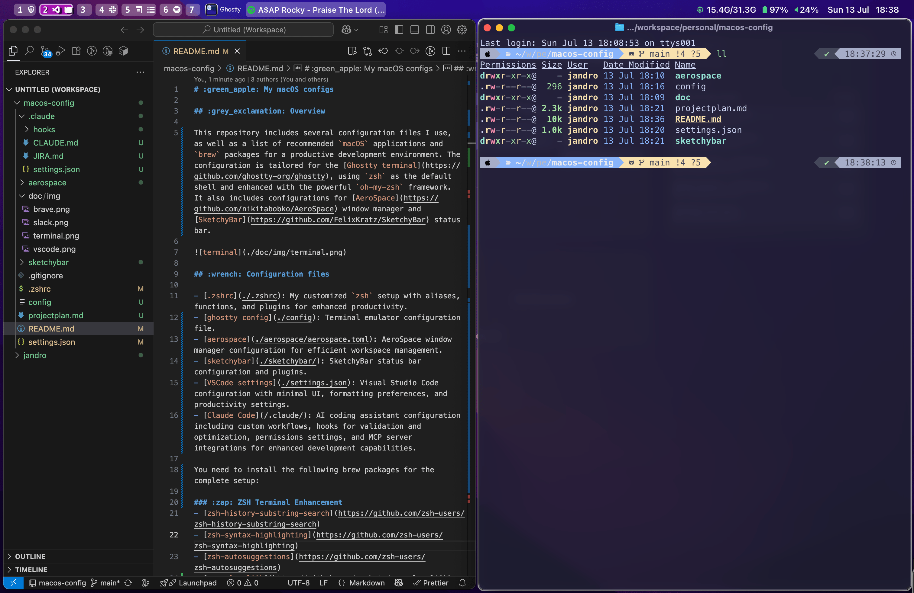

# :green_apple: My macOS configs

## :grey_exclamation: Overview

This repository includes several configuration files I use, as well as a list of recommended `macOS` applications and `brew` packages for a productive development environment. The configuration is tailored for the [Ghostty terminal](https://github.com/ghostty-org/ghostty), using `zsh` as the default shell and enhanced with the powerful `oh-my-zsh` framework. It also includes configurations for [AeroSpace](https://github.com/nikitabobko/AeroSpace) window manager and [SketchyBar](https://github.com/FelixKratz/SketchyBar) status bar.



## :wrench: Configuration files

- [.zshrc](./.zshrc): My customized `zsh` setup with aliases, functions, and plugins for enhanced productivity.
- [ghostty config](./config): Terminal emulator configuration file.
- [aerospace](./aerospace/aerospace.toml): AeroSpace window manager configuration for efficient workspace management.
- [karabiner](./karabiner_remap_left_option_to_command_option_control.json): Karabiner-Elements configuration to remap the left Option/Alt key for AeroSpace workspace switching while preserving special character functionality.
- [sketchybar](./sketchybar/): SketchyBar status bar configuration and plugins.
- [VSCode settings](./settings.json): Visual Studio Code configuration with minimal UI, formatting preferences, and productivity settings.
- [Claude Code](/.claude/): AI coding assistant configuration including custom workflows, hooks for validation and optimization, permissions settings, and MCP server integrations for enhanced development capabilities.

You need to install the following brew packages for the complete setup:

### :zap: ZSH Terminal Enhancement

- [zsh-history-substring-search](https://github.com/zsh-users/zsh-history-substring-search)
- [zsh-syntax-highlighting](https://github.com/zsh-users/zsh-syntax-highlighting)
- [zsh-autosuggestions](https://github.com/zsh-users/zsh-autosuggestions)
- [powerlevel10k](https://github.com/romkatv/powerlevel10k): A fast and customizable Zsh theme

### :computer: Command Line Tools

- [bat](https://github.com/sharkdp/bat): A cat clone with syntax highlighting (used in aliases)
- [eza](https://github.com/eza-community/eza): A modern replacement for ls (used in aliases)

### :hammer_and_wrench: Development Tools

- [nvim](https://neovim.io/): Modern Vim-based text editor
- [z](https://github.com/jethrokuan/z): Jump around directories based on frequency and recency

## :dango: Recommended apps and packages

### :apple: apps

- [Ghostty](https://github.com/ghostty-org/ghostty): Ghostty is a terminal emulator that differentiates itself by being fast, feature-rich, and native. While there are many excellent terminal emulators available, they all force you to choose between speed, features, or native UIs. Ghostty provides all three
- [Raycast](https://www.raycast.com/): Raycast is a powerful, keyboard-driven productivity tool for macOS that lets users quickly perform tasks, run commands, and manage workflows through an intuitive launcher interface.
- [Latest](https://apps.apple.com/de/app/meeter-for-zoom-teams-co/id1510445899?l=en-GB&mt=12): Software and apps update checker.
- [PastePal](https://apps.apple.com/es/app/pastepal-clipboard-manager/id1503446680): PastePal is a clipboard manager for macOS that helps users efficiently manage and organize their copied text, images, and files. It features a clean interface, quick access via a global shortcut, and advanced functionalities like searching, pinning, and syncing clips across devices. Designed for productivity, PastePal integrates seamlessly with macOS, offering privacy-focused clipboard history management and customization options for a streamlined workflow.
- [Shottr](https://shottr.cc/): Shottr is a macOS screenshot tool designed for speed and precision, offering features like pixel-perfect annotations, OCR for text extraction, scrolling screenshots, and on-the-fly image editing. It is lightweight and caters to developers, designers, and anyone needing advanced screenshot capabilities, while maintaining a user-friendly and minimalistic interface.
- [AeroSpace](https://github.com/nikitabobko/AeroSpace): AeroSpace is an i3-like tiling window manager for macOS. It's designed to be fast, configurable, and provides efficient workspace management with keyboard-driven navigation.
- [Karabiner-Elements](https://karabiner-elements.pqrs.org/): A powerful keyboard customizer for macOS. The included configuration remaps the left Option/Alt key to work seamlessly with AeroSpace workspace switching while preserving the ability to type special characters (like åéñ) using the right Option key.
- [Visual Studio Code](https://code.visualstudio.com/): VSCode is my primary code editor, offering excellent extensibility, integrated terminal, Git integration, and powerful debugging capabilities. Its lightweight yet feature-rich approach makes it perfect for development workflows.
- [Clop](https://lowtechguys.com/clop/): Clop automatically optimizes images, videos, PDFs, and clipboard content to reduce file size with minimal quality loss. It features automatic clipboard optimization, screen recording compression, drag-and-drop file optimization, and works entirely on-device without cloud services.
- [Dropover](https://dropoverapp.com/): Dropover simplifies file management through an innovative drag and drop system with floating shelves. It allows you to collect, organize, share, and process files using an intuitive "shake and drop" mechanism, making file transfer and organization significantly easier.
- [MeetingBar](https://meetingbar.app/): MeetingBar is a free, open-source menu bar application that streamlines online meeting management. It provides one-click meeting access, supports 50+ meeting services, integrates with all calendars, and eliminates manual meeting link navigation.
- [Raindrop](https://raindrop.io/): Raindrop.io is an all-in-one bookmark manager designed for creatives and coders. It offers organizational tools with collections and tags, instant web page previews, cross-platform access, full-text search, and automatic webpage backups in a privacy-focused environment.
- [superwhisper](https://superwhisper.com/): superwhisper is an AI-powered voice-to-text application that enables writing 3x faster through speech. It supports 100+ languages, works entirely offline on your device for privacy, includes custom vocabulary support, and works across any app where you can type or paste text.
- [Claude Code](https://claude.ai/code): Claude Code is my AI coding assistant of choice, providing intelligent code generation, debugging, and project management capabilities. It offers seamless integration with development workflows through MCP servers, custom hooks for validation and optimization, and supports complex multi-file operations with contextual understanding.

## :shield: Special mention: Brave Browser

I chose Brave for my development work because it offers unique features that align perfectly with modern web development and security needs. Brave provides built-in ad and tracker blocking, which significantly improves browsing speed and privacy without requiring additional extensions. Its Chromium-based engine ensures compatibility with all web development tools and extensions I need.

One standout feature is Brave's approach to privacy by default, blocking third-party trackers and ads while still supporting legitimate websites. The browser also includes built-in HTTPS Everywhere functionality and fingerprinting protection. For development work, Brave's DevTools are identical to Chrome's, providing familiar debugging and testing capabilities while maintaining better privacy and performance compared to traditional browsers.

## :robot: Claude Code Configuration

The `.claude/` directory contains comprehensive configuration for Claude Code, my AI coding assistant:

### :gear: Core Configuration Files

- **[CLAUDE.md](/.claude/CLAUDE.md)**: Defines my standard development workflow including:

  - 10-step structured approach: problem analysis → planning → verification → implementation → review
  - Integration with MCP servers (context7, memory, sequentialthinking)
  - Emphasis on simplicity and minimal code changes
  - Todo-driven development with projectplan.md tracking

- **[JIRA.md](/.claude/JIRA.md)**: Complete Jira ticket creation templates and guidelines:

  - DevOps-specific field mappings and custom field IDs
  - Structured ticket template with Product Owner, Developer, and QA sections
  - Sprint and Squad assignment instructions
  - Compliance with Datical Jira instance requirements

- **[settings.json](/.claude/settings.json)**: Advanced Claude Code configuration featuring:
  - **Permissions**: Granular tool access control (WebFetch, Bash, Read/Write/Edit operations)
  - **Pre-tool hooks**: Validation scripts for Write and Edit operations
  - **Post-tool hooks**: Optimization scripts that run after file modifications
  - **Stop hooks**: Project summary generation on session completion

This configuration ensures consistent, validated, and optimized development workflows with comprehensive project tracking and quality controls.

## :link: MCP servers

```json
  "mcpServers": {
    "atlassian": {
      "type": "sse",
      "url": "https://mcp.atlassian.com/v1/sse"
    },
    "context7": {
      "type": "stdio",
      "command": "npx",
      "args": [
        "-y",
        "@upstash/context7-mcp"
      ],
      "env": {}
    },
    "puppeteer": {
      "type": "stdio",
      "command": "npx",
      "args": [
        "-y",
        "@modelcontextprotocol/server-puppeteer"
      ],
      "env": {}
    },
    "github": {
      "command": "docker",
      "args": [
        "run",
        "-i",
        "--rm",
        "-e",
        "GITHUB_PERSONAL_ACCESS_TOKEN",
        "ghcr.io/github/github-mcp-server"
      ],
      "env": {
        "GITHUB_PERSONAL_ACCESS_TOKEN": "**************"
      }
    },
    "taskmaster-ai": {
      "command": "npx",
      "args": [
        "-y",
        "--package=task-master-ai",
        "task-master-ai"
      ],
      "env": {
        "MAX_TOKENS": 64000,
        "TEMPERATURE": 0.2,
        "DEFAULT_SUBTASKS": 5,
        "DEFAULT_PRIORITY": "medium"
      }
    },
    "memory": {
      "command": "npx",
      "args": [
        "-y",
        "@modelcontextprotocol/server-memory"
      ]
    }
  }
```

### :space_invader: packages

- [Z](https://github.com/jethrokuan/z)
- [ccat](https://github.com/owenthereal/ccat)
- [eza](https://github.com/eza-community/eza)
